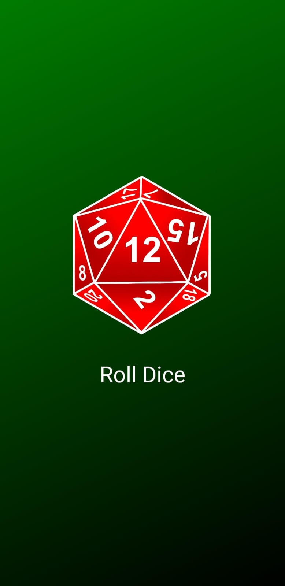

# dados
This Flutter application allows users to simulate rolling a 20-sided die and view the result. It generates random images representing each face of the 20-sided die, providing a fun and interactive way to mimic the experience of rolling a physical die.

# Features
Simulate rolling a 20-sided die with a single tap.
View random images representing each face of the die.
Enjoy a visually appealing and intuitive user interface.
Experience the excitement of dice rolling in a digital format.

## Screenshots

# Contributing
Contributions are welcome! If you find any issues or have suggestions for improvements, feel free to open an issue or submit a pull request.

# Credits
This application was inspired by a video tutorial created by Maximilian Schwarzmüller of the course of udemy: Flutter & Dart - The Complete Guide [2024 Edition]. Special thanks to him for providing the guidance and inspiration for building this project.

## Getting Started

This project is a starting point for a Flutter application.

A few resources to get you started if this is your first Flutter project:

- [Lab: Write your first Flutter app](https://docs.flutter.dev/get-started/codelab)
- [Cookbook: Useful Flutter samples](https://docs.flutter.dev/cookbook)

For help getting started with Flutter development, view the
[online documentation](https://docs.flutter.dev/), which offers tutorials,
samples, guidance on mobile development, and a full API reference.
